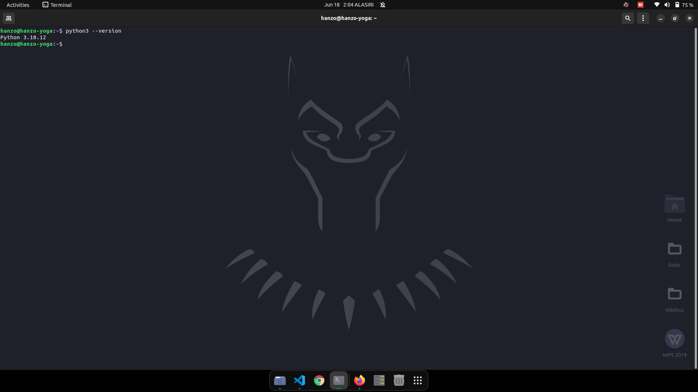

# Assignment: Introduction to Python

## Python Basics

### What is Python, and what are some of its key features that make it popular among developers? Provide examples of use cases where Python is particularly effective.

Python is a high-level, interpreted programming language known for its simplicity and readability. It supports multiple programming paradigms, including procedural, object-oriented, and functional programming. Some key features that make Python popular include:

- **Readability and Simplicity:** Python's syntax is clean and easy to understand, making it accessible for beginners and efficient for experienced programmers.
- **Extensive Libraries:** Python has a vast standard library and many third-party libraries that simplify complex tasks.
- **Cross-Platform Compatibility:** Python works on various operating systems, including Windows, macOS, and Linux.
- **Community Support:** A large and active community contributes to a wealth of resources, tutorials, and frameworks.

**Use Cases:**

- **Web Development:** Using frameworks like Django and Flask.
- **Data Science and Machine Learning:** Libraries such as Pandas, NumPy, and Scikit-learn.
- **Automation and Scripting:** Automating repetitive tasks.
- **Game Development:** Libraries such as Pygame.
- **Embedded Systems:** Using MicroPython.

## Installing Python

### Describe the steps to install Python on your operating system (Windows, macOS, or Linux). Include how to verify the installation and set up a virtual environment.

#### Installing Python on linux

in linux, python come pre-installed and to check the version use `python3 --version`


#### Verifying the Installation

Open Command Prompt and run:

```bash
python3 --version

```
 **setting up a virtual environment**
 1. Create a directory and name it
 2. Open terminal and navigate to the directory
 3. Run `python3 -m venv myenv` (replace myenv with you pr eferable name.
 4. Activate the virtual environment by running `source myenv/bin/activate` (on Linux)


###     Python Syntax and semantic

```python
 print("Hello, World)
 ```
 
**Explanation**
- `print()` is a built-in function that prints its argument to the console.
- `"Hello, World"` is a string literal, which is a sequence of characters enclosed in quotes

### Data Types and Variables
List and describe the basic data types in Python. Write a short script that demonstrates how to create and use variables of different data types.

**Basic Data Type**
- **Integers (int):** Whole numbers, e.g., 1, 2,
- **Floats (float):** Decimal numbers, e.g., 3.14, -
- **Strings (str):** Sequences of characters, e.g., "hello", 'hello
- **Boolean (bool):** True or False values
- **List (list):** Ordered collections of items, e.g., [1, 2]
- **Tuple (tuple):** Ordered, immutable collections of itemS.
- **Dictionary (dict):** Unordered collections of key-value pairs.
- **Set (set):** Unordered collections of unique items.
- **NoneType (None):** Represents the absence of a value.

**Example Script:**
```python
  # Integer
age = 25
# Float
height = 5.9
# String
name = "Alice"
# Boolean
is_student = True
# List
numbers = [1, 2, 3, 4, 5]
# Tuple
coordinates = (10.0, 20.0)
# Dictionary
person = {"name": "Alice", "age": 25}
# Set
unique_numbers = {1, 2, 3, 4, 5}

print(age, height, name, is_student, numbers, coordinates, person, unique_numbers)


```

### Control Structure
**Conditional Statements**
Are used to execute code based on conditions.
```python
x = 10
if x > 5:
    print("x is greater than 5")
else:
    print("x is 5 or less")

```
**Loops**
Used to execute code repeatedly
```python
for i in range(5):
    print(i)

```

### Functiob in Python
Functions are blocks of reusable code that perform a specific task. They help in organizing code and reducing redundancy.

```python
def add(a, b):
    return a + b

# Calling the function
result = add(3, 5)
print(result)

```

### Lists and Dictionaries
**Differences**
 - Lists are ordered collections of items that can be of any data type, including strings, integers, floats.
 - Dictionaries are unordered collections of key-value pairs accessed by key.

 ```python
 # List
numbers = [1, 2, 3, 4, 5]
numbers.append(6)
print(numbers)

# Dictionary
person = {"name": "Alice", "age": 25}
person["city"] = "New York"
print(person)

 ```
### Exception Handling
```python
try:
    result = 10 / 0
except ZeroDivisionError as e:
    print(f"Error: {e}")
finally:
    print("This block always executes")

```

### Modules and Packages
**Modules**. File containing Python code (functions, classes, variables) that can be imported
**Packages**. Directory containing multiple modules and an `__init__.py` file

```python
import math

print(math.sqrt(16))

```

### File I/O

**Reading from a file:**
```python
with open('example.txt', 'r') as file:
    content = file.read()
    print(content)

```

**Writing to a file**
```python
lines = ["Line 1", "Line 2", "Line 3"]
with open('output.txt', 'w') as file:
    for line in lines:
        file.write(line + '\n')

```